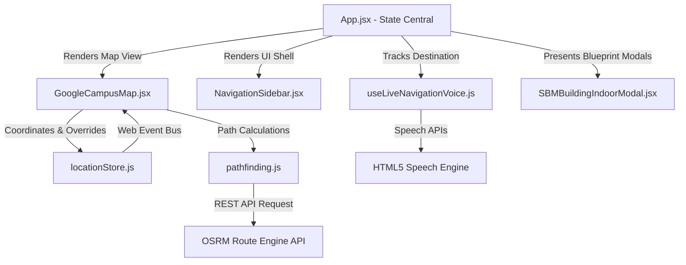

# CSJMU AI Summit 2026 & Smart Campus Digital Twin: Developer Guide

This developer guide provides an in-depth walkthrough of the codebase, system architecture, data models, and core algorithms of the **CSJMU Smart Campus Digital Twin and Navigation Platform**. It serves as an onboarding reference for developers looking to maintain, extend, or troubleshoot the application.

---

## 🗺️ Architectural Overview

The application is structured as a React 19 Single Page Application (SPA) powered by Vite 8. It features two primary modes of operation:
1. **Outdoor Mode (Satellite GIS)**: Uses [Leaflet](https://leafletjs.com/) to render Google Hybrid, ESRI HD, and standard roadmap layers. It supports department polygon overlays, routing via Dijkstra-like calculations or OSRM road snapping, and custom pin plotting.
2. **Indoor Mode (School of Business Management - SBM Digital Twin)**: Renders interactive vector SVG/Canvas blueprints of multiple floors, featuring real-time watercooler telemetry (RO + UV status, water temperature, filter status), classroom directory, and an indoor corridor pathfinder.

### Flow of Coordination



---

## 📂 Codebase Modules & Entry Points

### 1. The Central Coordinator
*   **File**: [`frontend/src/App.jsx`](file:///C:/Users/252342/Desktop/Navigation-App/frontend/src/App.jsx)
*   **Responsibility**: Coordinates top-level states: `currentLocation`, `destination`, `navMode` (`'hidden' | 'preview' | 'active'`), and modal overlays. It links geolocations, routes, and layout panels together.

### 2. Live Tracking & Speech Synthesis Co-Pilot
*   **File**: [`frontend/src/hooks/useLiveNavigationVoice.js`](file:///C:/Users/252342/Desktop/Navigation-App/frontend/src/hooks/useLiveNavigationVoice.js)
*   **Responsibility**:
    *   Watches browser location coordinates (`navigator.geolocation.watchPosition`) using a **jitter filter** (requiring moves $\ge$ 3.5m or time elapsed $\ge$ 3s to trigger updates, optimizing battery/GPS polling).
    *   Synthesizes turn-by-turn guidance and ETA readouts via `SpeechSynthesisUtterance`.
    *   Uses a Haversine formula to compute geodesic distances in meters and step counts (meters / 0.75m per average step).

### 3. Road-Network Pathfinding Engine
*   **File**: [`frontend/src/utils/pathfinding.js`](file:///C:/Users/252342/Desktop/Navigation-App/frontend/src/utils/pathfinding.js)
*   **Responsibility**:
    *   Requests road-snapped walking routes from the Open Source Routing Machine (OSRM) Public API (`/route/v1/foot/`).
    *   Converts coordinates from OSRM's format `[Longitude, Latitude]` to Leaflet's `[Latitude, Longitude]`.
    *   Maintains a local `routeCache` (using `Map`) to cache calculated coordinate networks, preventing redundant API requests.

### 4. Event-Driven Coordinate Overrides & Storage
*   **File**: [`frontend/src/utils/locationStore.js`](file:///C:/Users/252342/Desktop/Navigation-App/frontend/src/utils/locationStore.js)
*   **Responsibility**:
    *   Merges static map locations from [`auditoriumData.js`](file:///C:/Users/252342/Desktop/Navigation-App/frontend/src/data/auditoriumData.js) with user custom-plotted pins and coordinate overrides.
    *   Triggers cross-component reactivity by dispatching custom DOM events (`csjmu_locations_updated`) whenever coordinates are updated, resetting default coords, or hiding pins.

### 5. Google Satellite / GIS Canvas
*   **File**: [`frontend/src/components/GoogleCampusMap.jsx`](file:///C:/Users/252342/Desktop/Navigation-App/frontend/src/components/GoogleCampusMap.jsx)
*   **Responsibility**:
    *   Renders Leaflet layers dynamically supporting Google Hybrid (`lyrs=y`), Pure Satellite (`lyrs=s`), Google Roadmap (`lyrs=m`), and Esri HD.
    *   Loads department polygon boundaries defined in [`auditoriumData.js`](file:///C:/Users/252342/Desktop/Navigation-App/frontend/src/data/auditoriumData.js) and maps out markers for landmarks.
    *   Enables *Plotting Mode* where clicking the map triggers a building creation prompt.

### 6. SBM Indoor Digital Twin & Watercooler Telemetry
*   **File**: [`frontend/src/components/SBMBuildingIndoorModal.jsx`](file:///C:/Users/252342/Desktop/Navigation-App/frontend/src/components/SBMBuildingIndoorModal.jsx)
*   **Responsibility**:
    *   Renders Ground Floor (L0), First Floor (L1), and Second Floor (L2) layout blueprints.
    *   Displays purified water network telemetry (Cold RO, digital touchless fountains) containing data: water temperature, purity percentages (e.g. 99.9%), capacity, and location descriptions.
    *   Houses the **Indoor Corridor Pathfinder** which simulates room-to-room path directions (such as "Enter through SBM Main Corridor entrance. Pass SBM-01...").

### 7. Voice Navigation & AI Assistant Modal
*   **File**: [`frontend/src/components/AIAssistantModal.jsx`](file:///C:/Users/252342/Desktop/Navigation-App/frontend/src/components/AIAssistantModal.jsx)
*   **Responsibility**:
    *   A rule-based and voice-driven assistant that parsed natural queries (like searching for *washrooms*, *registration desk*, *specific stalls*, or *keynote schedule*).
    *   Uses native browser Speech Recognition (`webkitSpeechRecognition` or `SpeechRecognition`) for speech-to-text.

---

## ⚡ Development & Scripts

### Prerequisites
*   **Node.js**: `v18.0.0` or higher
*   **npm**: `v9.0.0` or higher

### Script Catalog

From the [`frontend`](file:///C:/Users/252342/Desktop/Navigation-App/frontend) folder:
*   `npm install` - Installs package requirements (Leaflet, Lucide Icons, Three.js, etc.).
*   `npm run dev` - Launches local Hot Module Replacement (HMR) development server at `http://localhost:5173`.
*   `npm run build` - Compiles the project into an optimized production-ready bundle.
*   `npm run lint` - Runs high-speed linting diagnostics using `oxlint`.
*   `npm run preview` - Runs a local webserver to preview the production bundle build.

---

## ⚖️ Core Algorithms & Implementations

### Haversine Formula for Distance calculations
Calculated inside [`useLiveNavigationVoice.js`](file:///C:/Users/252342/Desktop/Navigation-App/frontend/src/hooks/useLiveNavigationVoice.js#L18-L26):
```javascript
const calcMeters = (lat1, lon1, lat2, lon2) => {
  const R = 6371000; // Radius of Earth in meters
  const dLat = (lat2 - lat1) * Math.PI / 180;
  const dLon = (lon2 - lon1) * Math.PI / 180;
  const a = Math.sin(dLat / 2) * Math.sin(dLat / 2) +
            Math.cos(lat1 * Math.PI / 180) * Math.cos(lat2 * Math.PI / 180) *
            Math.sin(dLon / 2) * Math.sin(dLon / 2);
  return R * 2 * Math.atan2(Math.sqrt(a), Math.sqrt(1 - a));
};
```

### Jitter Filter for Geolocation Polls
To conserve device battery and avoid visual twitching on map updates, new locations are filtered inside [`useLiveNavigationVoice.js`](file:///C:/Users/252342/Desktop/Navigation-App/frontend/src/hooks/useLiveNavigationVoice.js#L52-L58):
```javascript
// Only update state if moved >= 3.5 meters OR (moved >= 1.5 meters AND >= 3000ms elapsed)
if (distMeters >= 3.5 || (distMeters >= 1.5 && timeElapsed >= 3000)) {
  lastPosRef.current = { lat: latitude, lng: longitude };
  lastTimeRef.current = now;
  setUserPos({ lat: latitude, lng: longitude });
}
```
